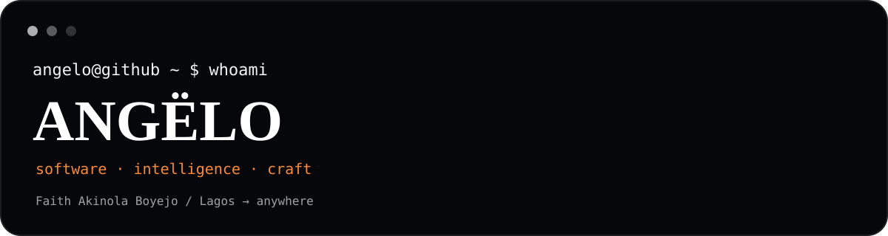

<div align="center">



<br/>

`angelo@github ~ $` **./build.sh**

**Software Engineer · AI/ML Engineer · Founder**

*Building the web. Training machines. Shipping things.*

<a href="https://github.com/Cyberangelo-King">GitHub</a> ·
<a href="https://www.linkedin.com/in/faithakinolaboyejo/">LinkedIn</a> ·
<a href="https://beacons.ai/theangeloking">Portfolio</a> ·
<a href="https://thewebmaven.netlify.app">The Web Maven</a>

</div>

---

## `$ whoami`

**Faith Akinola Boyejo. Angëlo.**

I build software, intelligence systems, and products around problems that are actually worth solving.

I move between **engineering, AI/ML, product, security, design, automation, business, and writing** because real problems rarely arrive with a convenient tech-stack label attached.

> **I solve real problems, not tutorial problems.**

I am obsessed with learning, but I don't want learning to remain consumption.

**Understand → build → test → break → learn → build better.**

---

## `$ ./orientation.sh`

My work sits somewhere around here:

```text
                         PURPOSE
                            │
                     ┌──────┴──────┐
                     │             │
                   MIND         MINDSET
                     │             │
                understanding   character
                     │             │
                     └──────┬──────┘
                            │
                          CRAFT
                            │
                            ▼
                          IMPACT
```

The technical work is visible.

The things underneath it matter too.

**Think deeply. Build deliberately. Stay curious. Keep becoming.**

---

## `$ ./why`

Because curiosity should become capability.

I want to understand difficult things deeply enough to turn them into something useful:

a system, a product, a tool, a model, a better question, or a clearer way of thinking.

I am building toward becoming a **world-class engineer and founder** capable of creating products, companies, and systems that outlive the individual projects that started them.

> **I am not trying to build everything. I am trying to become capable of building what matters.**

`per aspera ad astra.`

---

## `$ ./current-state.sh`

```text
╭────────────────────────────────────────────────────╮
│ ANGËLO :: CURRENT STATE                            │
├────────────────────────────────────────────────────┤
│ role       Software Engineer / AI-ML / Founder     │
│ focus      Systems / Products / Intelligence       │
│ building   The Web Maven + independent products   │
│ learning   Always                                  │
│ philosophy Per aspera ad astra                     │
│ status     Building...                             │
╰────────────────────────────────────────────────────╯
```

And, because apparently a serious engineering profile needs this:

```text
BUILDING      █████████░  90%
LEARNING      ██████████ 100%
OVERTHINKING  ██████████ 100%
SLEEPING      ██░░░░░░░░  20%
```

*The numbers are scientifically questionable.*

---

# `$ ./projects.sh`

### ⚡ Momentum
**Event Intelligence & Relationship OS**

A privacy-first system for turning real-world events into durable context, relationship intelligence, actionable follow-up, and compounding learning.

**Intelligence · Memory · Governance · Security · Offline resilience**

<a href="https://github.com/Cyberangelo-King/Momentum">Repository ↗</a>

### 🧠 OROS
**Problem Intelligence & Problem-Solving System**

A system built around:

`Find → Research → Abstract → Build → Reflect → Share`

**AI · Research · Problem solving · ALEN · Mobile-first**

<a href="https://github.com/Cyberangelo-King/OROS">Repository ↗</a>

### 📄 IHatePDF
**Privacy-first browser document toolkit**

Browser-first document tooling designed around local processing, useful workflows, and honest client-side guarantees.

**JavaScript · PDF.js · PDF-lib · Tesseract.js · Browser APIs**

<a href="https://github.com/Cyberangelo-King/IHatePDF">Repository ↗</a>

### 🤖 Fraud Detection ML System
**Applied ML · Decision Support · Explainability**

An ensemble fraud detection system using XGBoost, Random Forest, and Logistic Regression, with leakage-aware evaluation, SHAP explainability, FastAPI inference, and a Streamlit dashboard.

**AUPRC 0.903 · F1 0.881 · MCC 0.884**

<a href="https://github.com/Cyberangelo-King/Ensemble-Machine-Learning-for-Online-Credit-Card-Fraud-Detection">Repository ↗</a>

### 🌐 The Web Maven
**Founder-led software & web studio**

Strategic websites, software, AI integration, automation, SEO, and digital systems.

> **Specific beats polished. Every time.**

<a href="https://thewebmaven.netlify.app">Visit The Web Maven ↗</a>

### 🎓 AOFESTUS
**Academic research & identity platform**

A production academic website built around structured research data, accessibility, SEO, identity, and maintainability.

<a href="https://aofestus.com">Visit ↗</a>

---

## `$ ./stack.sh`

**Languages**

Python · TypeScript · JavaScript · HTML · CSS

**Frontend**

React · Next.js · React Native · Tailwind CSS · Three.js · WebGL

**Backend & Data**

Node.js · FastAPI · PostgreSQL · Supabase · Streamlit

**AI / ML**

scikit-learn · XGBoost · NumPy · Pandas · Gemini · AI Agents

**Engineering**

Git · GitHub · GitHub Actions · Linux · Netlify · Vercel

> Tools change. **Architecture, problem-solving, security, testing, communication, and shipping remain.**

---

## `$ ./how-i-build.sh`

```text
     PROBLEM
        │
        ▼
    DISCOVER
        │
        ▼
     DESIGN
        │
        ▼
    ENGINEER
        │
        ▼
     VERIFY
        │
        ▼
      SHIP
        │
        ▼
      LEARN
        │
        └──────────────↺
```

The loop matters more than the stack.

I ask:

- What problem are we actually solving?
- What does the system need to guarantee?
- What can fail?
- What happens when someone abuses it?
- What should remain simple?
- How will we know whether it worked?
- What did we learn that should change the next version?

**Clarity over cleverness. Evidence over assumptions. Systems over isolated features.**

---

## `$ ./principles.sh`

```text
01  Start with the problem, not the stack.
02  Make the simplest useful system first.
03  Treat security and privacy as architecture concerns.
04  Measure what matters.
05  Document important decisions.
06  Build for failure, not just the happy path.
07  Keep AI bounded by explicit authority.
08  Automate repetitive work.
09  Ship, observe, improve.
```

> **Don't claim what the system cannot actually guarantee.**

---

## `$ ./lab.sh`

The Lab is where I test ideas before deciding whether they deserve a product.

AI agents. Interfaces. Browser tools. Automation. WebGL. ML experiments. Strange prototypes. Useful little utilities.

Some become products.

Some become lessons.

Some exist because I looked at a problem and thought:

> **"Hmm. I wonder if I can make that work."**

---

## `$ ./writing.sh`

I also write.

Technology, business, psychology, philosophy, purpose, execution, and the human side of building things.

Because knowing **how** to build something is only half the problem.

The other half is knowing **what is worth building in the first place.**

<a href="https://faithboyejo.substack.com/">Read my writing ↗</a>

---

## `$ ./signals.sh`

<div align="center">

<a href="https://github.com/Cyberangelo-King">
<picture>
  <source media="(prefers-color-scheme: dark)" srcset="https://github-readme-stats.vercel.app/api?username=Cyberangelo-King&show_icons=true&include_all_commits=true&hide_border=true&theme=github_dark&rank_icon=github&custom_title=Ang%C3%ABlo%27s%20GitHub%20Stats">
  <source media="(prefers-color-scheme: light)" srcset="https://github-readme-stats.vercel.app/api?username=Cyberangelo-King&show_icons=true&include_all_commits=true&hide_border=true&theme=default&rank_icon=github&custom_title=Ang%C3%ABlo%27s%20GitHub%20Stats">
  
</picture>
</a>

<br/>

<a href="https://github.com/Cyberangelo-King">
<picture>
  <source media="(prefers-color-scheme: dark)" srcset="https://github-readme-stats.vercel.app/api/top-langs/?username=Cyberangelo-King&layout=compact&langs_count=8&hide_border=true&theme=github_dark&custom_title=Languages">
  <source media="(prefers-color-scheme: light)" srcset="https://github-readme-stats.vercel.app/api/top-langs/?username=Cyberangelo-King&layout=compact&langs_count=8&hide_border=true&theme=default&custom_title=Languages">
  
</picture>
</a>

<br/><br/>

<a href="https://github.com/Cyberangelo-King">
  
</a>

<br/><br/>

<picture>
  <source media="(prefers-color-scheme: dark)" srcset="https://raw.githubusercontent.com/Cyberangelo-King/Cyberangelo-King/output/github-contribution-grid-snake-dark.svg">
  <source media="(prefers-color-scheme: light)" srcset="https://raw.githubusercontent.com/Cyberangelo-King/Cyberangelo-King/output/github-contribution-grid-snake.svg">
  
</picture>

</div>

---

## `$ ./faq.sh`

<details>
<summary><strong>Why is your GitHub so broad?</strong></summary>

Because the problems I care about are broad.

I don't want to become excellent at one tool and mediocre at thinking.

</details>

<details>
<summary><strong>Software engineer, ML engineer, or founder?</strong></summary>

Yes.

Software engineering is the foundation. AI/ML is an area I am pushing deeper into. Building products and companies is where I want that capability to compound.

</details>

<details>
<summary><strong>Why document the work?</strong></summary>

Because finished code hides decisions.

The build trail makes the reasoning, trade-offs, failures, and lessons inspectable.

</details>

<details>
<summary><strong>What does Per aspera ad astra mean here?</strong></summary>

Through hardships to the stars.

Not romanticizing difficulty. Making something of it.

Learn. Adapt. Endure. Build. Become.

</details>

<details>
<summary><strong>What are you ultimately building toward?</strong></summary>

Capability, then leverage.

Products. Companies. Systems. Ideas that can outlive the project that started them.

</details>

---

## `$ ./contact.sh`

I'm open to **software engineering, AI/ML work, contract projects, product collaborations, technical problem-solving, and interesting partnerships**.

The best fit is usually a **real problem** with enough complexity to make the solution interesting.

<div align="center">

### Building from Lagos. Thinking globally. Shipping deliberately.

<a href="mailto:faithakinboyejo@gmail.com">Email Angëlo ↗</a> ·
<a href="https://www.linkedin.com/in/faithakinolaboyejo/">Connect on LinkedIn ↗</a> ·
<a href="https://thewebmaven.netlify.app">Build with The Web Maven ↗</a>

<br/><br/>

<sub><strong>Faith Akinola Boyejo</strong> · Angëlo · Software Engineer · AI/ML Engineer · Founder</sub>

<br/><br/>

<sub><em>per aspera ad astra.</em></sub>

</div>

<!--
  easter egg:
  if you found this, you probably read too far.
  respect.
-->
